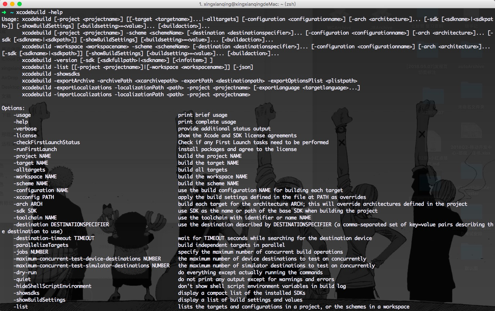

### iOS 自动化之路 --（使用xcodebuild + fir + python + AppleScript实现一键自动打包）

	

### 一、打包步骤如下
- 打包
- 导出
- 上传
- 打开网页
- 删除archive包和ipa包

### 二、准备：

- 需要把打包使用的plist文件准备好（可以根据自己需要通过手动打包生成，我这里是一个项目中有两个target）


- xcodebuild （打包 和 导出 使用）


- fir（上传步骤 使用fir.im，也可以使用其他平台）

1.注册fir.im，拿到api_token


2.需要安装fir 平台的工具 fir-cli


```
gem install  fir-cli

```


以下为fir-cli的使用


### 三、python脚本(这边是针对在同一个项目中有两个target进行编写的)

**脚本内容**


```
# -*- coding:utf-8 -*-
#!/usr/bin/env python

import argparse
import commands

#参数说明：
#-workspace JinRongProject.xcworkspace  #.xcworkspace文件名字
#-scheme WangCaiTarget   				#可以在项目目录下执行xcodebuild -list获取
#-configuration Debug    				#Debug 或者 Release
#-archivePath                           #生成.archive文件之后放在哪个路径
#CODE_SIGN_IDENTITY						#证书的的名字
#PROVISIONING_PROFILE_SPECIFIER			#描述文件的名字
#-exportPath							#导出.ipa文件要放在哪个路径
#-exportOptionsPlist                    #plist文件的路径

#==============================设置常量====================================
#下面关于list中的元素，在配置的时候顺序要对应
WORKSPACE_NAME="xxxxxxxx.xcworkspace"
TARGETS=['xxxxxxxx','xxxxxxxx']
BUILD_CONFIGURATION= 'Debug'  #'Debug' 或者 Release
ARCHIVE_PATH='~/Desktop'
# =============================Enterprise配置====================================
EXPORT_PLIST_PATH=['xxxxxxxx', 'xxxxxxxx']
BUILD_CODE_SIGN_IDENTITY=['xxxxxxxx','xxxxxxxx']
BUILD_PROVISIONING_PROFILE_SPECIFIER=['xxxxxxxx','xxxxxxxx']
# =============================development配置（自动化使用）====================================
# BUILD_CODE_SIGN_IDENTITY=['xxxxxxxx','xxxxxxxx']
# BUILD_PROVISIONING_PROFILE_SPECIFIER=['xxxxxxxx','xxxxxxxx'];
# EXPORT_PLIST_PATH=['xxxxxxxx.plist','xxxxxxxx.plist']
# ==============================推送包使用developer证书===========================================
# EXPORT_PLIST_PATH=['xxxxxxxx.plist','xxxxxxxx.plist']
# BUILD_CODE_SIGN_IDENTITY=['xxxxxxxx','xxxxxxxx']
# BUILD_PROVISIONING_PROFILE_SPECIFIER=['xxxxxxxx','xxxxxxxx']

#fir.im API Token
FIR_TOKEN="xxxxxxxxxxxxxxxxxxxxxxxx"
#app在fir.im的下载页面地址
TARGET_URL_ADDRESS=['https://fir.im/apps/xxxxxxxxxxxxxxxxxxx','https://fir.im/apps/xxxxxxxxxxxxxxxxxxx']  
#target在list中的索引
INDEX=0

#=========================================================================

#输出
def statusLog(logString):
	print "+---------------------------------------------------------------------------------+"
	print "|                                                                                 |"
	print "                               %s                                                  " %(logString)
	print "|                                                                                 |"
	print "+---------------------------------------------------------------------------------+"

#打开网页
def openUrl():
	openUrlCmd = 'open %s' %(TARGET_URL_ADDRESS[INDEX])
	print "---> 打开网页命令：%s" %(openUrlCmd)
	(status, output) = commands.getstatusoutput(openUrlCmd)
	if status == 0:
		statusLog('网页已经打开，可以去获取二维码了!')
	else:
		statusLog('打开网页失败，自己手动去打开吧!')
		
#上传
def uploadToFirm(scheme):
	ipaPath = "%s/%sIPA/%s.ipa" %(ARCHIVE_PATH,scheme,scheme)
	uploadCmd = 'fir p %s -T %s' %(ipaPath,FIR_TOKEN)
	print "---> fir上传命令：%s" %(uploadCmd)
	statusLog('正在上传中,先让代码飞一会~~~')
	(status, output) = commands.getstatusoutput(uploadCmd)
	if status == 0:
		statusLog('上传成功！')
		openUrl()
		clearArchive(scheme)
	else:
		print status, output
		statusLog('上传失败！')

#删除archive包和ipa包（上传完成之后才可调用）
def clearArchive(scheme):
	xcarchivePath='%s/%s.xcarchive' %(ARCHIVE_PATH,scheme)
	ipaPath='%s/%sIPA' %(ARCHIVE_PATH,scheme)
	clearCmd = 'rm -r %s %s' %(xcarchivePath,ipaPath) 
	print "---> 删除.xcarchive、ipa命令：%s" %(clearCmd)
	(status, output) = commands.getstatusoutput(clearCmd)
	if status == 0:
		statusLog('删除.xcarchive、ipa文件成功')
	else:
		print status, output
		statusLog('删除.xcarchive、ipa文件失败')


#导出
def exportArchive(scheme):
	exportCmd = "xcodebuild -exportArchive -archivePath %s/%s.xcarchive -exportPath %s/%sIPA -exportOptionsPlist %s CODE_SIGN_IDENTITY='%s' PROVISIONING_PROFILE_SPECIFIER='%s'" %(ARCHIVE_PATH,scheme,ARCHIVE_PATH,scheme,EXPORT_PLIST_PATH[INDEX],BUILD_CODE_SIGN_IDENTITY[INDEX],BUILD_PROVISIONING_PROFILE_SPECIFIER[INDEX])
	print "---> 导出命令：%s" %(exportCmd)
	statusLog('正在导出中,先让代码飞一会~~~')
	(status, output) = commands.getstatusoutput(exportCmd)
	if status == 0:
		uploadToFirm(scheme)
	else:
		print status, output
		statusLog('导出失败!')

#打包
def archiveWorkspace(workspace, scheme):
	archiveCmd = "xcodebuild archive -workspace %s -configuration %s -scheme %s -archivePath %s/%s.xcarchive CODE_SIGN_IDENTITY='%s' PROVISIONING_PROFILE_SPECIFIER='%s'" %(workspace,BUILD_CONFIGURATION,scheme,ARCHIVE_PATH,scheme,BUILD_CODE_SIGN_IDENTITY[INDEX],BUILD_PROVISIONING_PROFILE_SPECIFIER[INDEX])
	print "---> 打包命令：%s" %(archiveCmd)
	statusLog('正在打包中,先让代码飞一会~~~')
	(status, output) = commands.getstatusoutput(archiveCmd)
	#print status, output
	if status == 0:
		exportArchive(scheme)
	else:
		print status, output
		statusLog('打包失败')	

def xcbuild(options):
	workspace=WORKSPACE_NAME
	global INDEX
	INDEX=TARGETS.index(options.scheme)
	scheme=options.scheme
	if workspace is not None and scheme is not None:
		archiveWorkspace(workspace, scheme)
	else:
		statusLog('请先配置workspace、scheme信息')
	
def main():
	parser = argparse.ArgumentParser()
	parser.add_argument("-s", "--scheme", help="scheme name")
	options = parser.parse_args()
	print "options: %s" %(options)
	xcbuild(options)
	
if __name__ == '__main__':
	main()

```


我这边脚本是放在~/Desktop/autoArchive目录下的，使用以下命令，就可以进行打包了


```
python ~/Desktop/autoArchive/archive.py -s <targetName>

```


**效果**


### 四、使用AppleScript代替每次执行自动打包脚本都需要去终端输入命令的操作

AppleScript 是 Mac OS X内置的一种功能强大的脚本语言，使用 AppleScript 的目的是把一些重复繁琐并且耗费时间的任务自动化。

AppleScript使用 mac 自带的脚本编辑器进行编译运行


打开编辑器，选择 文件 -> 打开词典 可以看见支持AppleScript操作的应用


选择需要操作的应用，可以查看API


**例**：这里使用脚本代替每次执行自动打包脚本需要输入命令的操作


```
tell application "iTerm"
	create window with default profile
	select first window
	tell the first window
		tell current session to write text "cd ~/Documents/91jinronglicai"
		tell current session to write text "python ~/Desktop/autoArchive/archive.py -s WangCaiTarget"
	end tell
end tell
```


如果想有声音提示，加上beep即可，beep 、 beep 2


```
set testString to "test"
display dialog testString
beep 3
```


AppleAcript入门 <https://segmentfault.com/a/1190000011273388>

脚本编译运行成功之后可以导出为仅运行的程序


现在点击图标，运行，即可打包了 
